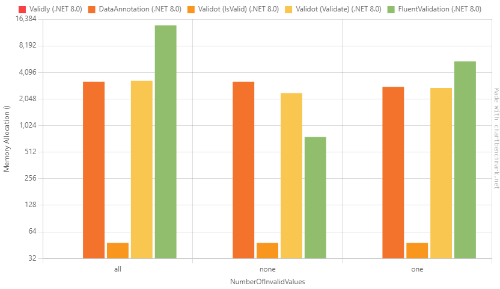

# Benchmarks

A comprehensive benchmark comparing <mark style="color:purple;">**Validly**</mark> with other popular .NET validation libraries, focusing on both performance (execution time) and memory allocation efficiency. The benchmark was conducted using [BenchmarkDotNet](https://github.com/dotnet/BenchmarkDotNet). The full source code of the benchmark is available [here](https://github.com/Hookyns/validly/tree/main/Benchmarks/Benchmarks).

### Compared Libraries

* System.ComponentModel.DataAnnotations,
* [FluentValidation](https://github.com/FluentValidation/FluentValidation),
* [Validot](https://github.com/bartoszlenar/Validot)

## Results

> BenchmarkDotNet v0.14.0, Windows 11 (10.0.26100.2314)
>
> CPU: AMD Ryzen 7 PRO 8840HS
>
> .NET SDK 8.0.404\
> &#x20;   \[Host] : .NET 8.0.11 (8.0.1124.51707), X64 RyuJIT AVX-512F+CD+BW+DQ+VL+VBMI \
> &#x20;   .NET 8.0 : .NET 8.0.11 (8.0.1124.51707), X64 RyuJIT AVX-512F+CD+BW+DQ+VL+VBMI

Raw data are stored [here](https://github.com/Hookyns/validly/blob/main/Benchmarks/Benchmarks/BenchmarkDotNet.Artifacts/results/Benchmarks.SimpleValidationLibrariesComparisonBenchmark-report-github.md).

### Input

In all the charts, the **NumberOfInvalidValues** is represented on the X-axis. This parameter corresponds to the number of invalid values in the validated object. Three distinct instances were used for validation:

* **All** – Every value was invalid, triggering error messages for all validation rules.
* **None** – All values were valid, resulting in no error messages.
* **One** – Only a single value was invalid, causing a validation error for just that specific value.

```csharp
public IEnumerable<CreateUserRequest> Objects =>
    new CreateUserRequest[]
    {
        // "None"
        new()
        {
            Username = "username",
            Password = "S0m3_pa55w0rd#",
            Email = "email@gmail.com",
            Age = 25,
            FirstName = "Tony",
            LastName = "Stark"
        },
        // "One"
        new()
        {
            Username = "",
            Password = "S0m3_pa55w0rd#",
            Email = "email@gmail.com",
            Age = 25,
            FirstName = "Tony",
            LastName = "Stark"
        },
        // "All"
        new()
        {
            Username = "Tom",
            Password = "pass",
            Email = "email[at]gmail.com",
            Age = 16,
            FirstName = "",
            LastName = ""
        },
};
```

### Execution Time

As seen in the results, the clear winner in terms of performance is _**Validot**_ when using their `IsValid()` validation method. This method exits the validation process early, avoiding the generation of error messages. For the "_none_" instance (where all values are valid), the execution time is similar to that of other libraries because the validation process has to evaluate all rules for all properties, as there are no invalid values to trigger an early exit. Notably, <mark style="color:purple;">**Validly**</mark> does not yet implement an early exit functionality, which is why its performance is slightly affected in this case. However, when excluding the early-exit variant of **Validot**, <mark style="color:purple;">**Validly**</mark> outperforms the other libraries.


The Y-axis is logarithmic.


<figure><figcaption><p>Execution time in nano seconds for a single validation of one object</p></figcaption></figure>

### Memory Usage

In the bar chart below, you may notice that <mark style="color:purple;">**Validly**</mark> is not visible. It appears as the first bar, but it is absent from the chart because its allocated memory is zero.

<figure><figcaption><p>Allocated memory in bytes for a single validation of one object</p></figcaption></figure>


The instance of the **FluentValidation** validator was cached to ensure that only the .Validate() method call was benchmarked, eliminating any potential overhead from repeated object initialization.



The instance of the **Validot** validator was also cached.


