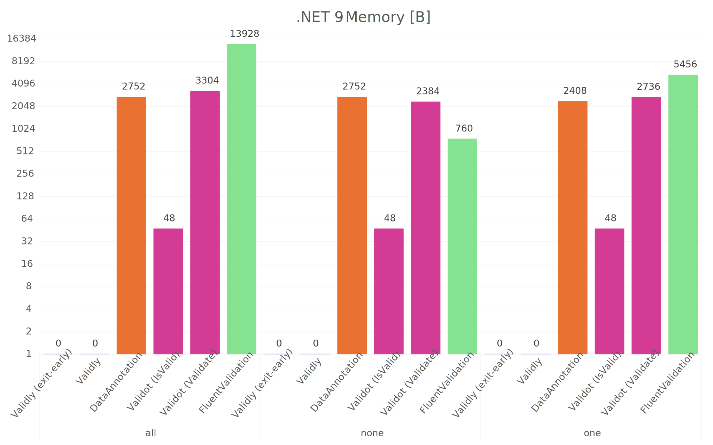
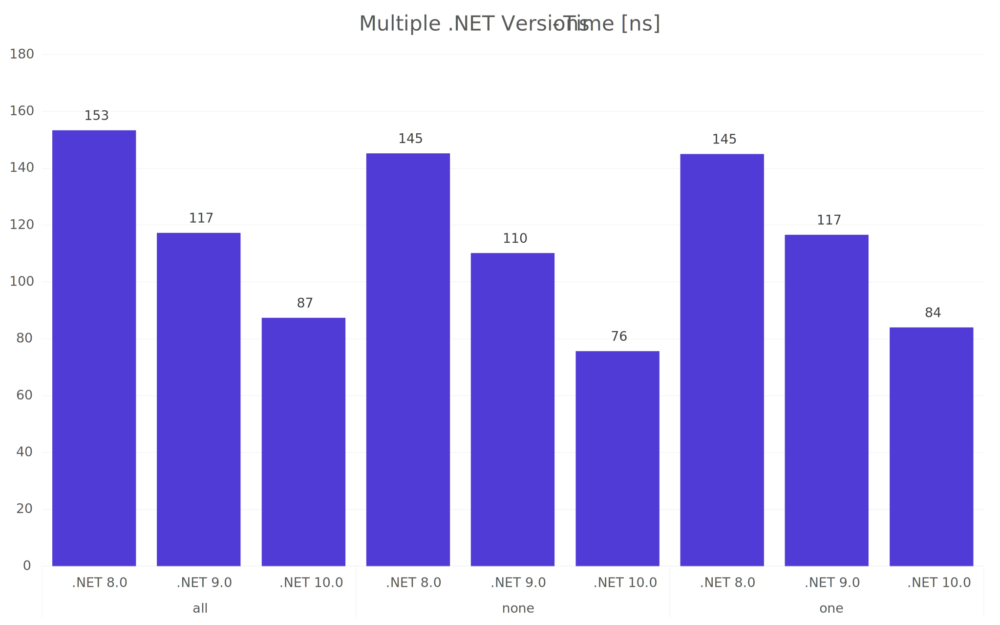

# Benchmarks

A comprehensive benchmark comparing <mark style="color:purple;">**Validly**</mark> with other popular .NET validation libraries, focusing on both performance (execution time) and memory allocation efficiency. The benchmark was conducted using [BenchmarkDotNet](https://github.com/dotnet/BenchmarkDotNet). The full source code of the benchmark is available [here](https://github.com/Hookyns/validly/tree/main/Benchmarks/Benchmarks).

### Compared Libraries

* System.ComponentModel.DataAnnotations,
* [FluentValidation](https://github.com/FluentValidation/FluentValidation),
* [Validot](https://github.com/bartoszlenar/Validot)

## Results

```
BenchmarkDotNet v0.15.4, Windows 11 (10.0.26100.6899/24H2/2024Update/HudsonValley)
AMD Ryzen 7 PRO 8840HS 3.30GHz, 1 CPU, 16 logical and 8 physical cores
.NET SDK 10.0.100-rc.1.25451.107
  [Host]   : .NET 9.0.6 (9.0.6, 9.0.625.26613), X64 RyuJIT x86-64-v4
  .NET 9.0 : .NET 9.0.6 (9.0.6, 9.0.625.26613), X64 RyuJIT x86-64-v4

```

Raw data are stored [here](https://github.com/Hookyns/validly/blob/main/Benchmarks/Benchmarks/BenchmarkDotNet.Artifacts/results/Benchmarks.SimpleValidationLibrariesComparisonBenchmark-report-github.md).

### Input

In all the charts, the **NumberOfInvalidValues** is represented on the X-axis. This parameter corresponds to the number of invalid values in the validated object. Three distinct instances were used for validation:

* **All** – Every value was invalid, triggering error messages for all validation rules.
* **None** – All values were valid, resulting in no error messages.
* **One** – Only a single value was invalid, causing a validation error for just that specific value.

```csharp
public IEnumerable<CreateUserRequest> Objects =>
    new CreateUserRequest[]
    {
        // "None"
        new()
        {
            Username = "username",
            Password = "S0m3_pa55w0rd#",
            Email = "email@gmail.com",
            Age = 25,
            FirstName = "Tony",
            LastName = "Stark"
        },
        // "One"
        new()
        {
            Username = "",
            Password = "S0m3_pa55w0rd#",
            Email = "email@gmail.com",
            Age = 25,
            FirstName = "Tony",
            LastName = "Stark"
        },
        // "All"
        new()
        {
            Username = "Tom",
            Password = "pass",
            Email = "email[at]gmail.com",
            Age = 16,
            FirstName = "",
            LastName = ""
        },
};
```

### Execution Time

As seen in the results, <mark style="color:purple;">**Validly**</mark> ranks among the fastest validation libraries tested, matching or outperforming **Validot** — and other popular validation libraries — in most scenarios. While **Validot’s `IsValid()`** method remains the absolute fastest, it achieves this primarily by exiting early and returning only a boolean result, without generating validation messages, which makes the comparison somewhat uneven. In contrast, <mark style="color:purple;">**Validly**</mark> produces complete validation results with detailed messages while still maintaining exceptional performance.

For the _“none”_ case (no validation errors), where all rules must be evaluated, <mark style="color:purple;">**Validly**</mark> and <mark style="color:purple;">**Validly**</mark> <mark style="color:purple;"></mark><mark style="color:purple;">(exit-early)</mark> outperform even **Validot (IsValid)**, demonstrating the efficiency of its generated code.&#x20;

In the _“one”_ and _“all”_ cases, the new **exit-early mode** enables <mark style="color:purple;">Validly</mark> to stop processing after the first error, achieving near-instant validation times. Overall, <mark style="color:purple;">**Validly**</mark> now combines comprehensive validation capabilities with performance that rivals or exceeds all other available validation libraries.


The Y-axis is logarithmic.


<figure><figcaption><p>Execution time in nano seconds for a single validation of one object</p></figcaption></figure>

### Memory Usage

In the bar chart below, you may notice that <mark style="color:purple;">**Validly**</mark> is barely visible, its allocated memory is zero.

<figure><figcaption><p>Allocated memory in bytes for a single validation of one object</p></figcaption></figure>


The instance of the **FluentValidation** validator was cached to ensure that only the .Validate() method call was benchmarked, eliminating any potential overhead from repeated object initialization.



The instance of the **Validot** validator was also cached.


## .NET Version Performance Comparison

The following chart shows the average validation time (in nanoseconds) of <mark style="color:purple;">Validly</mark> across different .NET versions. From .NET 8.0 to .NET 10.0, validation speed increased by **40–50%**, demonstrating significant JIT and runtime optimizations in newer versions. The results confirm that <mark style="color:purple;">**Validly**</mark> benefits directly from ongoing improvements in the .NET ecosystem.

<figure><figcaption></figcaption></figure>
